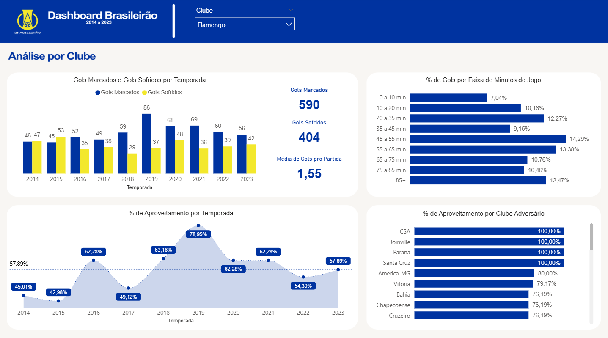

## Análise e Dashboard Campeonato Brasileiro (2014 a 2023)

## Objetivo do Projeto
Analisar e entender os principais KPIs do Campeonato Brasileiro de Futebol ao longo do tempo e explorar o desempenho por clubes e jogadores.

## Medidas e Indicadores
Na pasta `dashboard/medidas` é possível encontrar as principais medidas criadas em DAX para entender os indicadores.

## Dashboard Online
Para maior entendimento, disponibilizo o dashboard publicado no link abaixo:

👉 [Visualizar Dashboard no Power BI](https://app.powerbi.com/view?r=eyJrIjoiZTJjOTljMmEtMGRmYS00MmQ5LThmZTYtNDdlMjc2ZGVmMWNhIiwidCI6ImI3NmZlZDcxLWEwNjgtNDM4MC05OTcyLWEwMzEwZDc0ZTZmZSJ9)

